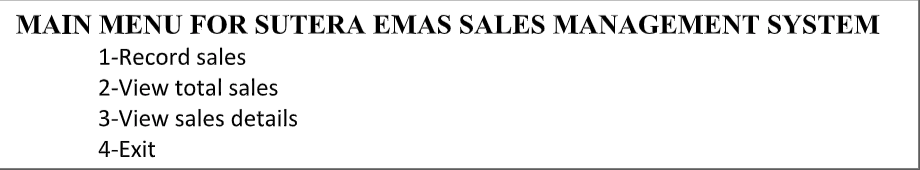
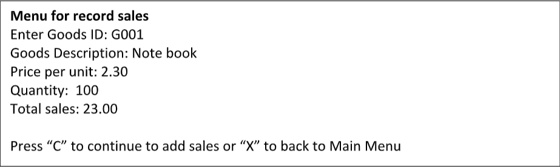
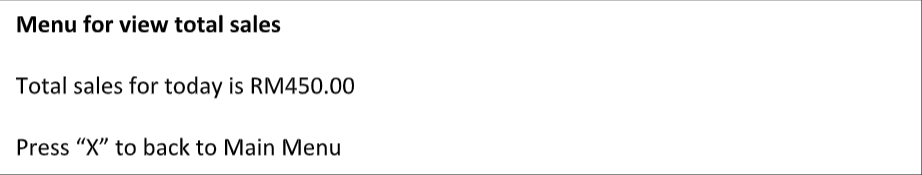
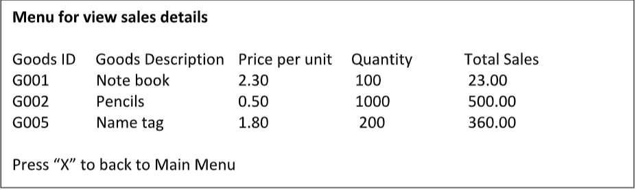

## Sales Management System
You are working at SUTERA EMAS Sdn. Bhd.  as a programmer. 
You were instructed to develop a part of Sales Management System for a client by using Java programming language.

Below is an example of the output.

### Steps to run the application
* Make sure you have **Java** in your system.
* Clone the project git clone https://github.com/nischalshakya15/SalesManagementSystem.git
* Go to the command prompt or terminal 
* Run `java -jar SalesManagementSystem.jar`

